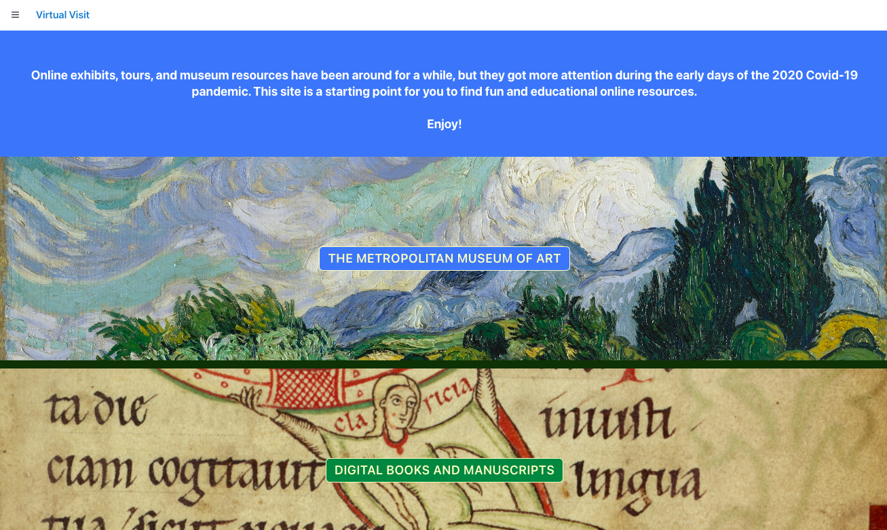
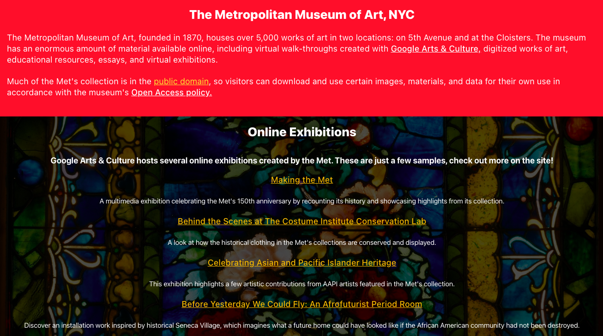
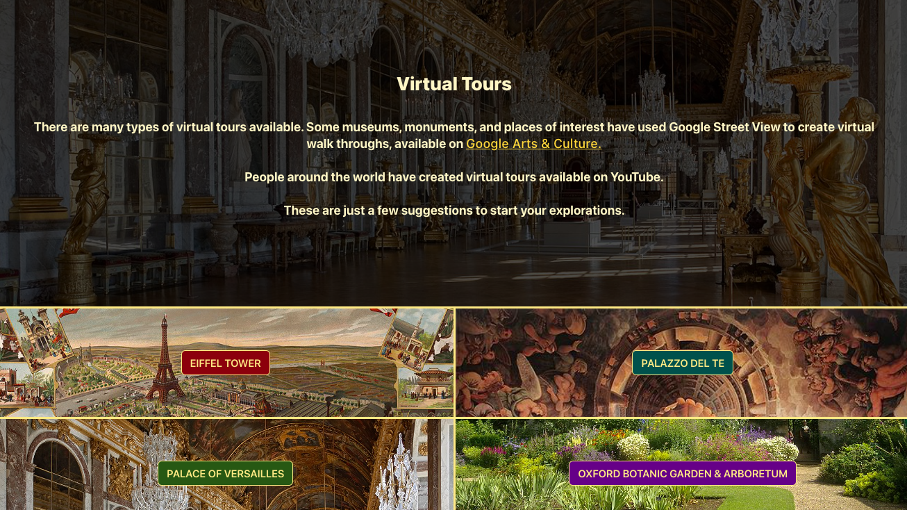
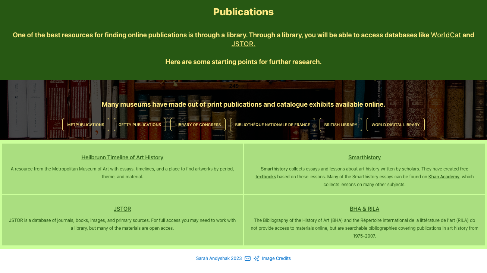
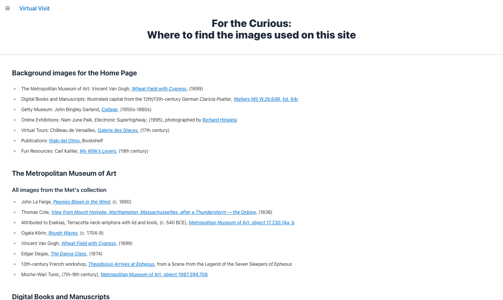

# Virtual Visit
_By Sarah Andyshak_

Online exhibits and tours have been around for a while, but got more attention during 2020. This site collects, summarizes, and directs you to options for activities you can experience from home. Enjoy!

This project was bootstrapped with [Create React App](https://github.com/facebook/create-react-app).

## Using This App
<!-- Visit the [site online here!]() -->

## Technologies Used
* React.js
* create-react-app
* TailwindCSS
* DaisyUI
* VS Code

## Screenshots
Splash/home page

Met resources

Virtual tour resources

Online publications directory

Image credits page

## Known Bugs
* As of 12/18/23, none.

## Disclaimer
Because this site connects you to external sites, links may stop working if the hosting institution removes them. All materials belong to the creators and institutions of origin.

## Images & Credits
* [museum favicon from icons8]("https://icons8.com/icon/4837/museum")
* [footer icons from heroicons]("https://heroicons.com/)

* Home Page- 
Metropolitan Museum of Art: [Van Gogh, "Wheat Field with Cypress"](https://www.metmuseum.org/art/collection/search/436535?searchField=All&amp;sortBy=Relevance&amp;high=on&amp;ao=on&amp;showOnly=openAccess&amp;ft=*&amp;offset=280&amp;rpp=40&amp;pos=315), 
Digital Books and Manuscripts: [Illustrated capital from the Claricia Psalter, Walters MS W.26.64R, fol. 64r](https://art.thewalters.org/detail/25823/claricia-swinging-on-an-initial-q-2/), 
Getty Museum: [John Bingley Garland, Collage](https://www.getty.edu/art/collection/object/109Q8D), 
Online Exhibitions: "Electronic Superhighway" by Nam June Paik in the Smithsonian American Art Museum, photographed by [Richard Hirajeta](https://unsplash.com/photos/xXJ5xPcknRA), 
Virtual Tours: [Galerie des Glaces, Château de Versailles](https://en.wikipedia.org/wiki/Palace_of_Versailles#/media/File:Chateau_Versailles_Galerie_des_Glaces.jpg), 
Publications: [Iñaki del Olmo, Book shelf ](https://unsplash.com/photos/NIJuEQw0RKg), 
Fun Resources: [Carl Kahler, "My Wife's Lovers](https://en.wikipedia.org/wiki/My_Wife%27s_Lovers#/media/File:Carl_Kahler_-_My_Wife's_Lovers.jpg)

* Metropolitan Museum of Art: see the Image Credits page (ImageCredits.js) for a list of works

* Manuscripts page: 
[Iñaki del Olmo, Book shelf ](https://unsplash.com/photos/NIJuEQw0RKg), 
[Library shelves, Susan Q Yin](https://unsplash.com/photos/2JIvboGLeho), 
[Illustrated capital from the Claricia Psalter, Walters MS W.26.64R, fol. 64r](https://art.thewalters.org/detail/25823/claricia-swinging-on-an-initial-q-2/),
[Edwin Davis French, Library of the Metropolitan Museum of Art bookplate](https://www.metmuseum.org/art/collection/search/821879), 
[Joris Hoefnagel, Mira Calligraphiae Monumenta, Getty MS 20 (86.MV.527), fol. 143](https://www.getty.edu/art/collection/object/105TPW), 
[13th century French workshop, Dedication page from the Moralized Bible of St. Louis, Morgan Library MS M.240, fol. 8r](https://www.themorgan.org/manuscript/77422), 
[Georges de Feure, illustration for La Porte des rêves](https://gallica.bnf.fr/ark:/12148/btv1b8600233m/f194.item)

* Getty Museum: see the Image Credits page (ImageCredits.js) for a list of works

* Online Exhibitions page: 
[John La Farge, Peonies Blown in the Wind](https://www.metmuseum.org/art/collection/search/5582) 
[John Bingley Garland, Collage](https://www.getty.edu/art/collection/object/109Q8D), 
[Renoir, Bal du moulin de la Galette](https://en.wikipedia.org/wiki/Mus%C3%A9e_d%27Orsay#/media/File:Pierre-Auguste_Renoir,_Le_Moulin_de_la_Galette.jpg), 
[Van Gogh, Sunflowers](https://en.wikipedia.org/wiki/Sunflowers_(Van_Gogh_series)#/media/File:Vincent_van_Gogh_-_Sunflowers_-_VGM_F458.jpg), 
[Botticelli, The Birth of Venus](https://en.wikipedia.org/wiki/The_Birth_of_Venus#/media/File:Sandro_Botticelli_-_La_nascita_di_Venere_-_Google_Art_Project_-_edited.jpg), 
[Oldenburg and van Bruggen, Shuttlecock](https://en.wikipedia.org/wiki/File:Shuttlecock_-_Nelson_Art_Gallery.png), 
[British Museum interior by Sharissa Johnson](https://unsplash.com/photos/RnT5Y9i9n94), 
[Stuart, The Lansdowne Portrait of George Washington](https://en.wikipedia.org/wiki/National_Portrait_Gallery_(United_States)#/media/File:Gilbert_Stuart_-_George_Washington_(Lansdowne_Portrait)_-_Google_Art_Project.jpg), 
[Jan Van Eyck, The Arnolfini Portrait](https://en.wikipedia.org/wiki/Arnolfini_Portrait#/media/File:The_Arnolfini_portrait_(1434).jpg), 
[Rembrandt, The Night Watch](https://en.wikipedia.org/wiki/The_Night_Watch#/media/File:The_Night_Watch_-_HD.jpg), 
[Pieter Brueghel the Elder, The Netherlandish Proverbs](https://en.wikipedia.org/wiki/File:Pieter_Brueghel_the_Elder_-_The_Dutch_Proverbs_-_Google_Art_Project.jpg), 
[Galerie des Glaces, Château de Versailles](https://en.wikipedia.org/wiki/Palace_of_Versailles#/media/File:Chateau_Versailles_Galerie_des_Glaces.jpg)

* Virtual Tours: 
[Unknown artist, View of the Eiffel Tower at the 1889 World's Fair](https://en.wikipedia.org/wiki/Eiffel_Tower#/media/File:Exposition_Universelle_de_Paris_1889_-_Universit%C3%A4ts-_und_Landesbibliothek_Darmstadt.jpg), 
[Giulio Romano, fresco "The Fall of the Giants" in the Palazzo del Te](https://en.wikipedia.org/wiki/Giulio_Romano#/media/File:Gigant.jpg), 
[Galerie des Glaces, Château de Versailles](https://en.wikipedia.org/wiki/Palace_of_Versailles#/media/File:Chateau_Versailles_Galerie_des_Glaces.jpg), 
[Oxford Botanical Garden & Arboretum](https://en.wikipedia.org/wiki/University_of_Oxford_Botanic_Garden#/media/File:An_obscured_Magdalen_Great_Tower_from_the_Botanic_Gardens.jpg), 
Himeji Castle photographed by 
[Shino](https://unsplash.com/photos/lpWPQ6KN5P4), 
Isabella Stewart Gardner Museum courtyard photographed by [Hanyang Zhang](https://unsplash.com/photos/Agz-3dok9Y8)

* Publications: [Iñaki del Olmo, Book shelf ](https://unsplash.com/photos/NIJuEQw0RKg)

* Fun Resources:
[18th-century English Puzzle Jug, Minneapolis Institute of Art 96.36.3](https://collections.artsmia.org/art/8946/puzzle-jug-england), 
[Joris Hoefnagel, Mira Calligraphiae Monumenta, Getty MS 20 (86.MV.527), fol. 143](https://www.getty.edu/art/collection/object/105TPW), 
[Botticelli, The Birth of Venus](https://en.wikipedia.org/wiki/The_Birth_of_Venus#/media/File:Sandro_Botticelli_-_La_nascita_di_Venere_-_Google_Art_Project_-_edited.jpg), 
"Electronic Superhighway" by Nam June Paik in the Smithsonian American Art Museum, photographed by [Richard Hirajeta](https://unsplash.com/photos/xXJ5xPcknRA), 
[Roman strigilated vase, Metropolitan Museum of Art object 2007.31a](https://www.metmuseum.org/art/collection/search/257818), [Carl Kahler, "My Wife's Lovers](https://en.wikipedia.org/wiki/My_Wife%27s_Lovers#/media/File:Carl_Kahler_-_My_Wife's_Lovers.jpg)

## License
[MIT](https://opensource.org/license/mit/)

Copyright (c) 2023, Sarah Andyshak